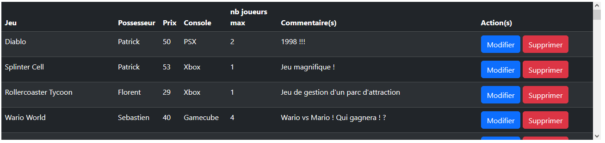

PDO
Principes

PDO ou "Php Data Object" est un moyen de se connecter à une base de données et un moyen de manipuler cette bdd. Son avantage tiens dans le fait qu'on utilise les mêmes méthodes pour manipuler des bases de données différentes (MySql, PostGre, Oracle, etc.).
Connexion avec PDO

Il faut pour se connecter :

    L'hôte
    le nom de la bdd
    le charset utilisé dans la bdd
    identifiant utilisateur bdd
    mot de passe utilisateur bdd

new PDO("mysql:host=‹nom de l'hôte›;dbname=‹nom bdd›; charset=‹jeu de caractère bdd›", "‹nom de l'utilisateur›", "‹mdp utilisateur›");
//exemple
$bdd = new PDO("mysql:host=localhost;dbname=026-php-inter-poo;charset=UTF8", "root", "");
Tester la connexion
Requêter avec PDO

On peut utiliser la méthode query
$response = $bdd->query("SELECT * FROM `jeux_video`");

D:\wamp64\www\026-php-inter-POO\src\Classes\Tools.php:21:
object(PDOStatement)[2]
  public string 'queryString' => string 'SELECT * FROM `jeux_video`' (length=26)

$response contient désormais le jeu d'enregistrements récupéré via la requête. On ne peut pas exploiter $response directement, il va falloir utliser les méthodes de PDO désormais utilisables avec $response.
$unEnregistrement = $response->fetch(PDO::FETCH_ASSOC);
print_r($unEnregistrement);
$unEnregistrement = $response->fetch(PDO::FETCH_ASSOC);
print_r($unEnregistrement);

D:\wamp64\www\026-php-inter-POO\src\Classes\Tools.php:21:
array (size=9)
  'ID' => int 1
  'nom' => string 'Super Mario Bros' (length=16)
  'possesseur' => string 'Florent' (length=7)
  'console' => string 'NES' (length=3)
  'prix' => float 4
  'nbre_joueurs_max' => int 1
  'commentaires' => string 'Un jeu d'anthologie !' (length=21)
  'date_ajout' => string '2024-04-30 16:17:29' (length=19)
  'date_modif' => string '2024-04-30 16:17:29' (length=19)

D:\wamp64\www\026-php-inter-POO\src\Classes\Tools.php:21:string 'Un jeu d'anthologie !' (length=21)

D:\wamp64\www\026-php-inter-POO\src\Classes\Tools.php:21:
array (size=9)
  'ID' => int 2
  'nom' => string 'Sonic' (length=5)
  'possesseur' => string 'Patrick' (length=7)
  'console' => string 'Megadrive' (length=9)
  'prix' => float 2
  'nbre_joueurs_max' => int 1
  'commentaires' => string 'Pour moi, le meilleur jeu du monde !' (length=36)
  'date_ajout' => string '2024-04-30 16:17:29' (length=19)
  'date_modif' => string '2024-04-30 16:17:29' (length=19)

D:\wamp64\www\026-php-inter-POO\src\Classes\Tools.php:21:string 'Pour moi, le meilleur jeu du monde !' (length=36)

fetch() renvoie l'enregistrement actuel où se trouve le curseur dans le jeu d'enregistrement. Une fois qu'il a renvoyé les données, le curseur passe à l'enregistrement suivant.

Il faut, une fois qu'on a finit d'utiliser les données, "fermer" le curseur.
$response->closeCursor();

D:\wamp64\www\026-php-inter-POO\src\Classes\Tools.php:21:boolean false

D:\wamp64\www\026-php-inter-POO\src\Classes\Tools.php:21:
object(PDOStatement)[2]
  public string 'queryString' => string 'SELECT * FROM `jeux_video`' (length=26)

Exploiter les résultats

Maintenant, on relance la requête et on va afficher les résultats dans un tableau généré par une boucle 

## Les requêtes préparées

Si on veut pouvoir choisir des paramètres pour la recherche (comme des filtres), il faut utiliser les méthodes PDO de préparation de requête. 